# ClueRoom Android App

<p align="center">
  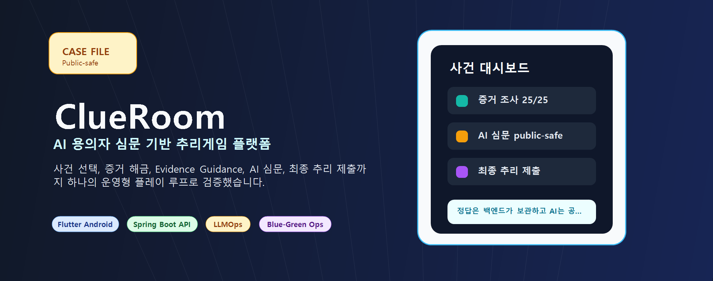
</p>

<p align="center">
  <a href="https://www.clueroom.xyz"></a>
  <a href="https://api.clueroom.xyz/actuator/health"></a>
  
  
</p>

ClueRoom Android 앱은 플레이어가 탐정이 되어 사건을 조사하고, 증거를 바탕으로 AI 용의자를 심문하며, 최종 추리를 제출하는 Flutter 기반 모바일 클라이언트입니다.

이 저장소는 **Android 화면 흐름, OAuth 로그인, JWT 세션 처리, 플레이 런타임 API 연동, 증거/심문/타임라인 UI, QA 검증 표면**을 담당합니다.

---

## Proof Snapshot

| Flutter Test | Auth | Session | Gameplay API | Safety | Release |
|---:|---:|---:|---:|---:|---:|
| **32 PASS** | Google/Kakao OAuth | active session recovery | scenario/play/evidence/AI/result | spoiler metadata safe | release APK build |

> Public-safe 기준에 따라 README에는 session token, QA 계정, 정답성/점수/범인명, raw user question, AI answer 전문을 포함하지 않습니다.

---

## Release / Demo Boundary

| Surface | Status | Note |
|---|---|---|
| Android APK | release APK build 가능 | Play Store 배포가 아니라 직접 설치 파일입니다. 설치 중 출처 확인/검사 안내가 뜰 수 있습니다. |
| Web | https://www.clueroom.xyz | 보안상 APK 직접 설치가 부담스러운 사용자를 위한 공개 브라우저 surface입니다. |
| Backend API | https://api.clueroom.xyz | Android와 Web이 같은 gameplay/auth API 계약을 사용합니다. |

앱 README는 Android 클라이언트의 구현과 QA 표면을 설명합니다. 최종 사용자 홍보나 공개 체험은 Web과 APK를 함께 안내하되, APK는 직접 설치 파일이라는 점을 명확히 표시합니다.

---

## Visual Evidence

<p align="center">
  
  <br>
  <sub>Local Android emulator E2E capture. 백엔드 local profile + 공식 시나리오 import 후 앱 화면을 직접 통과한 캡처입니다.</sub>
</p>

<table>
  <tr>
    <td width="25%">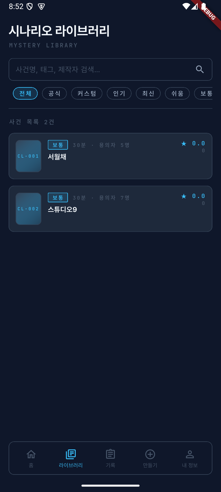<br><sub>Scenario Library</sub></td>
    <td width="25%">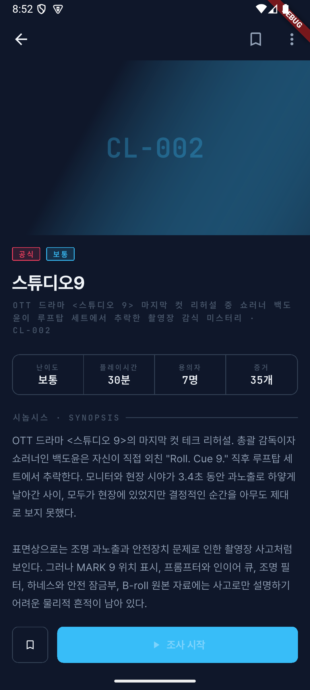<br><sub>Scenario Detail</sub></td>
    <td width="25%">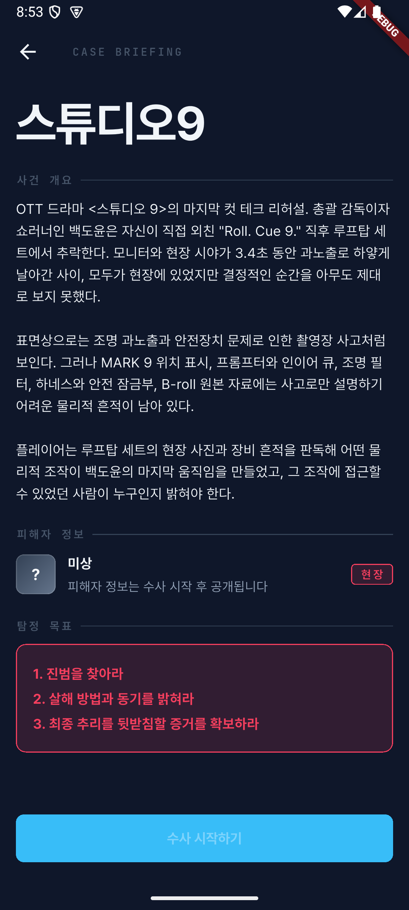<br><sub>Case Briefing</sub></td>
    <td width="25%">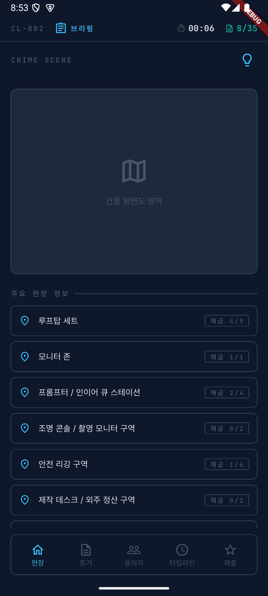<br><sub>Investigation Scene</sub></td>
  </tr>
  <tr>
    <td width="25%">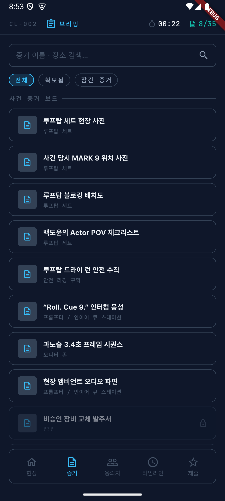<br><sub>Evidence Board</sub></td>
    <td width="25%">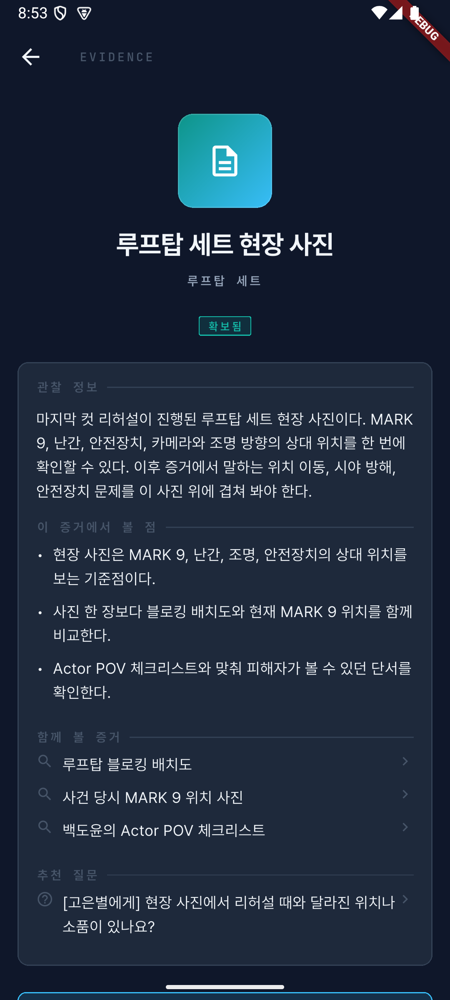<br><sub>Evidence Guidance</sub></td>
    <td width="25%">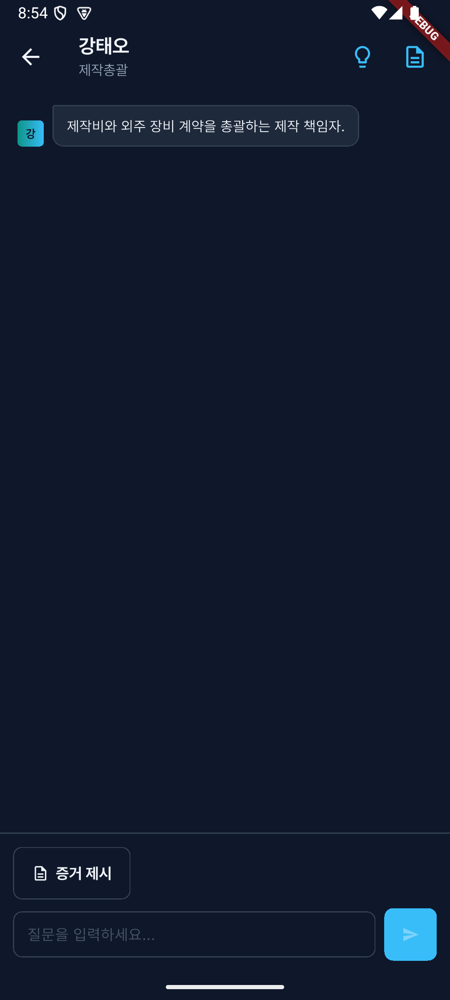<br><sub>AI Interrogation</sub></td>
    <td width="25%">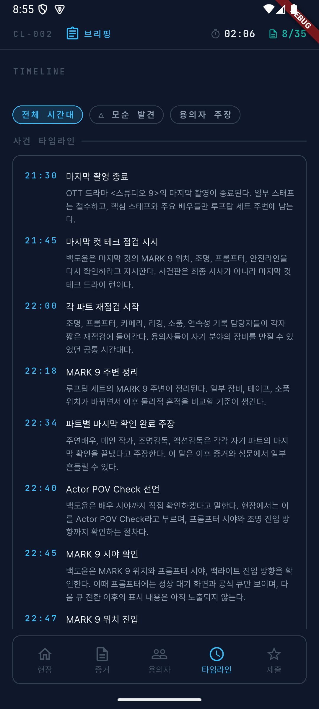<br><sub>Timeline</sub></td>
  </tr>
</table>

---

## App Role

ClueRoom은 Android 앱, Web 프론트, Spring Boot 백엔드가 함께 동작합니다. 이 저장소는 모바일 앱의 사용자 경험과 백엔드 API 계약을 연결하는 클라이언트 레이어입니다.

| Repository | Scope |
|---|---|
| `project-fe` | Flutter Android app, OAuth, session runtime, gameplay UI |
| [`start-up-project`](https://github.com/Final-Project-sixteam-company/start-up-project) | Spring Boot backend, AI/gameplay domain, infra, LLMOps, QA docs |
| [`clueroom-web-fe`](https://github.com/Final-Project-sixteam-company/clueroom-web-fe) | React/Vite web deployment surface |
| [Organization profile](https://github.com/Final-Project-sixteam-company) | 제품 소개, 팀 소개, repo map |

---

## Product Flow

```text
로그인
  -> 시나리오 라이브러리
  -> 사건 상세
  -> 사건 브리핑
  -> 현장 / 증거 / 용의자 / 타임라인 조사
  -> 증거 기반 AI 심문
  -> 최종 추리 제출
  -> 결과 조회
```

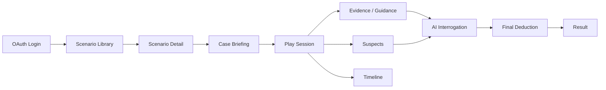

---

## Feature Highlights

| Area | Implementation | Why It Matters |
|---|---|---|
| OAuth Login | Google Sign-In, Kakao SDK, backend OAuth token exchange | 앱과 백엔드 JWT 세션을 실제 provider 로그인으로 연결 |
| Secure Session | `flutter_secure_storage`, refresh token recovery, logout/revoke flow | 앱 재실행/토큰 만료/로그아웃 race에서 세션 일관성 유지 |
| Scenario Library | `GET /api/scenarios`, keyword/type/difficulty/sort/page | 공식 시나리오를 운영 API 기준으로 목록/검색 |
| Scenario Detail | `GET /api/scenarios/{id}`, server `canPlay` | 플레이 가능 여부를 local allowlist가 아니라 백엔드 계약으로 제어 |
| Active Session | `GET /api/play-sessions/active`, 409 recovery | local 저장소가 비어도 서버의 진행 중 세션을 이어가기 |
| Investigation UI | locations, evidences, suspects, hints, timeline API | 사건 조사 화면을 백엔드 플레이 세션 상태와 동기화 |
| Evidence Guidance | reading points, compare evidence, suggested questions | “무엇을 누구에게 물어볼지”를 증거 상세에서 자연스럽게 연결 |
| Interrogation | `POST /interrogations`, evidence-presented question type | 사용자가 선택한 증거와 질문을 AI 심문 API에 전달하고, rate-limit error는 공통 `ApiException` 경로로 수신 |
| Final Deduction | culprit/motive/method/cover-up/evidence submit, result screen | 앱에서 플레이 루프를 결과까지 완결 |
| FCM | Firebase Messaging permission, token refresh, backend registration | 알림 인프라와 연결 가능한 모바일 surface 확보 |

---

## Auth & Session

앱은 OAuth provider token을 직접 서비스 세션으로 쓰지 않습니다. provider SDK에서 받은 토큰을 백엔드에 전달하고, 백엔드는 ClueRoom JWT access/refresh token을 발급합니다.

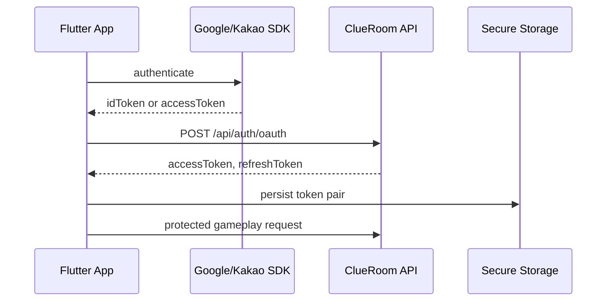

세션 처리 원칙:

- access/refresh token은 `flutter_secure_storage`에 저장합니다.
- access token 만료 시 refresh token으로 silent refresh를 시도합니다.
- 동시 401 refresh는 single-flight로 병합합니다.
- logout 중 in-flight refresh가 돌아와도 stale token을 저장하지 않습니다.
- secure storage read/migration 실패 시 앱이 죽지 않고 logged-out 상태로 복구합니다.

---

## Gameplay Runtime

앱의 `GameSessionController`는 플레이 화면이 공유하는 상태를 관리합니다.

| Runtime State | Source |
|---|---|
| active session | local saved session + `GET /api/play-sessions/active` |
| dashboard | `GET /api/play-sessions/{sessionId}/dashboard` |
| evidence unlock | `GET /api/play-sessions/{sessionId}/evidences?includeLocked=true` |
| locations | `GET /api/play-sessions/{sessionId}/locations` |
| suspects | `GET /api/play-sessions/{sessionId}/suspects` |
| timeline | `GET /api/play-sessions/{sessionId}/timeline` |
| hints | `GET/POST /api/play-sessions/{sessionId}/hints` |
| interrogation | `POST /api/play-sessions/{sessionId}/interrogations` |
| final deduction | `POST /api/play-sessions/{sessionId}/final-deduction` |
| result | `GET /api/play-sessions/{sessionId}/result` |

진행 중 세션 복구 흐름:

```text
local saved session resume
  -> server active session lookup
  -> create new play session
  -> on 409, active session lookup and resume
```

---

## Safety / Spoiler-Free UI

ClueRoom의 정답과 private solution은 백엔드 경계 안에 있어야 합니다. 앱은 public play API가 주는 안전한 표시용 필드만 사용합니다.

앱에서 지키는 기준:

- `imageAssetKey`, `portraitAssetKey` 같은 raw asset key를 화면 로직에 사용하지 않습니다.
- `importance`, `culpritEligible`, `suspicionLevel` 같은 정답성/추론 shortcut metadata에 의존하지 않습니다.
- 최종 지목 후보는 public witness 여부를 기준으로 구성합니다.
- suggested question chip은 자동 전송하지 않고 입력창 prefill로만 동작합니다.
- locked evidence는 백엔드 masking 정책을 그대로 존중합니다.

---

## Backend API Integration

| Feature | Endpoint |
|---|---|
| OAuth Login | `POST /api/auth/oauth` |
| Refresh | `POST /api/auth/refresh` |
| Logout | `POST /api/auth/logout` |
| Me | `GET /api/auth/me` |
| Device Token | `POST /api/device-tokens` |
| Scenario List | `GET /api/scenarios` |
| Scenario Detail | `GET /api/scenarios/{scenarioId}` |
| Active Session | `GET /api/play-sessions/active?scenarioId={scenarioId}` |
| Create Session | `POST /api/play-sessions` |
| Dashboard | `GET /api/play-sessions/{sessionId}/dashboard` |
| Locations | `GET /api/play-sessions/{sessionId}/locations` |
| Evidences | `GET /api/play-sessions/{sessionId}/evidences` |
| Evidence Detail | `GET /api/play-sessions/{sessionId}/evidences/{evidenceId}` |
| Suspects | `GET /api/play-sessions/{sessionId}/suspects` |
| Timeline | `GET /api/play-sessions/{sessionId}/timeline` |
| Hints | `GET /api/play-sessions/{sessionId}/hints` |
| Use Hint | `POST /api/play-sessions/{sessionId}/hints/{hintId}/use` |
| Interrogation | `POST /api/play-sessions/{sessionId}/interrogations` |
| Final Deduction | `POST /api/play-sessions/{sessionId}/final-deduction` |
| Result | `GET /api/play-sessions/{sessionId}/result` |
| Abandon | `POST /api/play-sessions/{sessionId}/abandon` |

API 계약의 정본은 백엔드 repo의 [CaseLab AI API Spec](https://github.com/Final-Project-sixteam-company/start-up-project/blob/develop/docs/CaseLab_AI_API_Spec.md)과 [Frontend Flow API Guide](https://github.com/Final-Project-sixteam-company/start-up-project/blob/develop/docs/frontend/CLUEROOM_APP_FLOW_API_GUIDE.md)를 따릅니다.

백엔드 AI quota 계약:

- 심문 성공 응답에는 `aiQuota` 안내 metadata가 포함될 수 있습니다.
- quota 초과는 `429 / AI_RATE_002`, quota 상태 확인 불가는 `503 / AI_RATE_003`으로 내려옵니다.
- 백엔드는 35/50/70/100/120회 구간에서 정리/힌트/최종추리 유도 metadata를 내려줄 수 있습니다.
- 앱은 현재 quota 초과/장애 응답을 공통 `ApiException` 경로로 수신합니다. 성공 응답의 `aiQuota` metadata를 화면에 표시하는 전용 안내 UI는 후속 작업입니다.

---

## QA & Tests

```bash
flutter test
```

현재 기준:

```text
32 tests passed
```

테스트 범위:

| Test Area | Coverage |
|---|---|
| AuthService | secure storage failure recovery, legacy migration, partial write cleanup, refresh/logout race |
| GameSessionController | active session recovery, 409 recovery |
| Models | play session, evidence, guidance, suspect, interrogation, final result parsing |
| Spoiler Safety | raw asset key fallback 차단, suggested question target parsing |

현재 QA 운영 기준:

| Document | Role |
|---|---|
| [QA_OPERATING_GUIDE](https://github.com/Final-Project-sixteam-company/start-up-project/blob/develop/docs/QA_OPERATING_GUIDE.md) | 현재 QA 운영 절차, public-safe 보고 기준, open issue board, 보고서 template 기준 |

최근 검증 근거:

| Document | Role |
|---|---|
| [QA_ANDROID_E2E_LOCAL_RETEST_REPORT_2026-06-18](https://github.com/Final-Project-sixteam-company/start-up-project/blob/develop/docs/qa/archive/QA_ANDROID_E2E_LOCAL_RETEST_REPORT_2026-06-18.md) | Android/local backend E2E evidence report. 로그인, 라이브러리, 상세, 브리핑, 조사 탭, 심문, 제출 화면 도달과 공식 시나리오 `25/25`, `35/35` evidence reachability 확인 |

Historical frontend issue reports:

| Document | Role |
|---|---|
| [docs/FRONTEND_QA_E2E_CULPRIT_CONFIRMATION_REPORT_2026-06-15.md](docs/FRONTEND_QA_E2E_CULPRIT_CONFIRMATION_REPORT_2026-06-15.md) | Android E2E / API fallback historical issue report |
| [docs/FRONTEND_E2E_QA_2026-06-12_CODEX.md](docs/FRONTEND_E2E_QA_2026-06-12_CODEX.md) | frontend E2E historical follow-up |
| [docs/README.md](docs/README.md) | frontend docs index |

> QA 보고서는 public-safe 기준을 따르며 정답성 세부, 점수, session/token, raw transcript를 공개하지 않습니다.

---

## Tech Stack

| Category | Stack |
|---|---|
| Language | Dart 3.12 |
| Framework | Flutter |
| Auth | Google Sign-In, Kakao Flutter SDK, JWT token flow |
| Secure Storage | `flutter_secure_storage`, `shared_preferences` |
| API | `http`, custom `ApiClient`, timeout/error normalization |
| Push | Firebase Core, Firebase Messaging |
| Images | `Image.network` + loading/error fallback |
| Design | Pretendard font, custom theme tokens, dark investigation UI |
| Test | `flutter_test`, model/controller/service tests |

---

## Run Locally

의존성 설치:

```bash
flutter pub get
```

로컬 백엔드 기본 연결:

```bash
flutter run
```

기본 API URL:

| Platform | Default |
|---|---|
| Android emulator | `http://10.0.2.2:18080` |
| desktop / simulator | `http://localhost:18080` |
| release | `https://api.clueroom.xyz` |

앱 레포의 local default는 포트 충돌 회피를 위해 `18080`을 사용합니다. 백엔드 repo를 기본 `8080`으로 띄운 경우 아래처럼 `API_BASE_URL`을 override합니다.

API override:

```bash
flutter run --dart-define=API_BASE_URL=https://api.clueroom.xyz
flutter run --dart-define=API_BASE_URL=http://10.0.2.2:8080
```

OAuth 설정은 `lib/core/oauth/oauth_config.dart`의 `--dart-define` 값을 기준으로 합니다. 실제 key/secret은 public README에 쓰지 않습니다.

---

## Build APK

운영 API 기준 release APK:

```bash
flutter build apk --release --dart-define=API_BASE_URL=https://api.clueroom.xyz
```

QA/dev login이 필요한 내부 테스트 빌드는 backend dev login 설정과 함께 별도 dart-define으로 관리합니다. 공개 배포 빌드에서는 QA/dev login 노출을 피합니다.

---

## Repository Map

```text
lib/
  core/
    api/           API base URL, ApiClient, ApiException
    device/        device id provider
    oauth/         OAuth dart-define config
  services/        AuthService, secure token handling
  repositories/    scenario/play-session API clients
  controllers/     GameSessionController and provider
  models/          backend DTO and UI models
  screens/         login, library, detail, case, evidence, suspect, chat, timeline, result
  components/      buttons, chips, evidence tiles, modals, shared UI
  theme/           colors, typography, tokens

docs/
  readme-assets/   README visual evidence
  archive/         historical frontend docs
  *.md             frontend integration and QA docs

test/
  controllers/     active session recovery tests
  models/          DTO parsing and spoiler-safe tests
  services/        auth secure storage and refresh/logout tests
```

---

## Notes

이 앱은 Android 중심으로 구현됐고, 최종 프로젝트 시연은 APK와 웹 배포를 함께 사용합니다. 웹 배포 surface는 별도 React/Vite repo에서 관리합니다.
